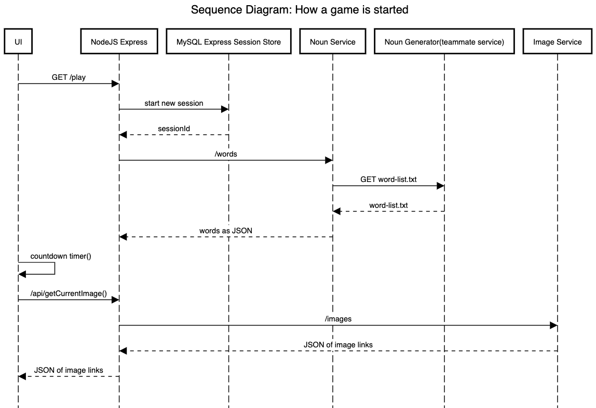

# What the Bing?! Noun importer service
This project imports a list of nouns from a teammate's service.  This then exposes an endpoint `/words` that can serve up the list.  This is a microservice that's part of the [What the Bing?! game](https://github.com/AnnawanDev/What-the-Bing-UI-service)

## How to run
### Local
* Build and Run: `npm run start`
* Build and Run in Debug (nodemon): `npm run dev`

### Production
* Build and Run with Forever: `npm run startProd`
* Stop Forever Production Run: `npm run stopProd`

## Sequence Diagram - How a game is started

## What the Bing?! Microservices
* [UI Service](https://github.com/AnnawanDev/What-the-Bing-UI-service)
* [Image Service](https://github.com/AnnawanDev/What-the-Bing-Image-Service)
* [Noun Service](https://github.com/AnnawanDev/What-the-Bing-noun-importer-service)
